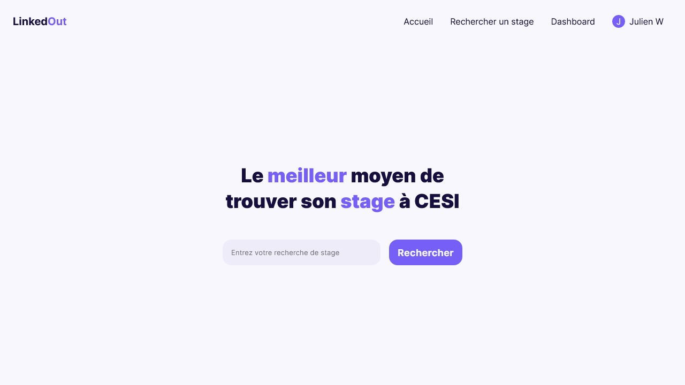
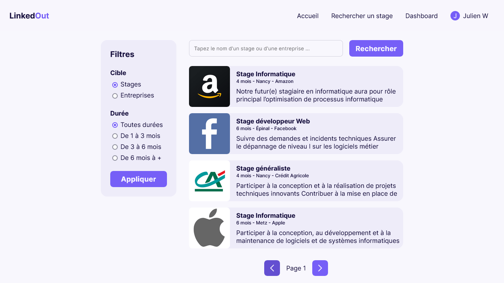
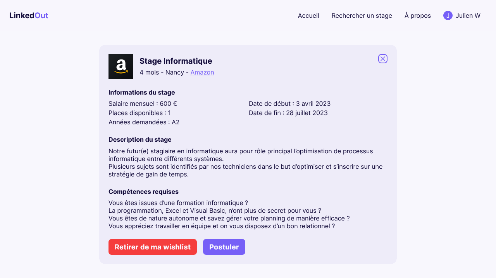
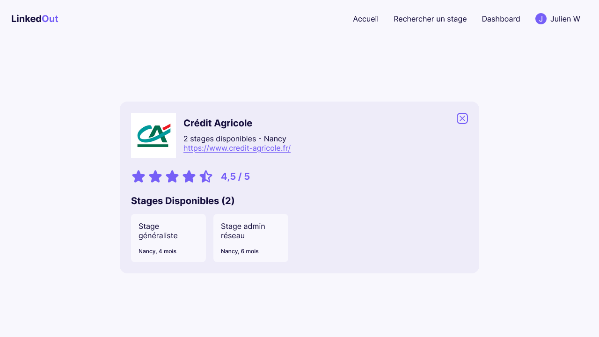
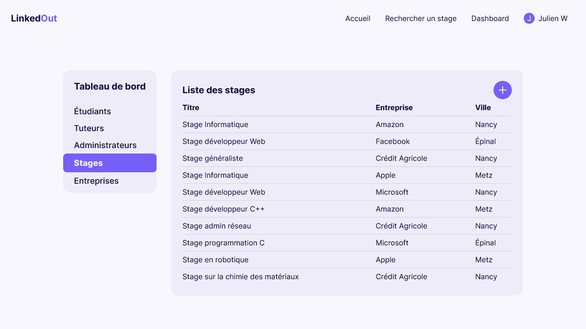
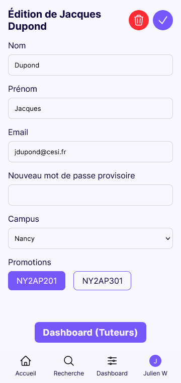
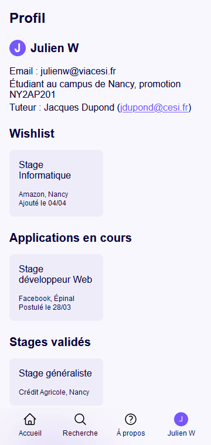

# LinkedOut



LinkedOut est un site web pour les étudiants de cESI, afin qu'ils puissent rechercher facilement
un stage. Il permet de rechercher un stage ou une entreprise, voir les détails, postuler, noter.

Les tuteurs peuvent poster les annonces de stage et voir l'état des candidatures des étudiants.

## Installation et développement

Le développement et le déploiement s'effectuent avec Docker.

Avant toute chose, il faut mettre en place les variables d'environnement. Pour cela, il faut
copier le fichier `.env.example` en `.env` et le remplir.

### Développement

Pour lancer le site en local, il faut commencer par installer les dépendances avec composer.
Un helper script utilisant docker est disponible. Il faut l'exécuter à la racine du projet.

```bash
./composer install
```

Ensuite, lancer le docker-compose à l'aide du helper script.

```bash
./compose-dev up -d --build
```

Il faut également compiler le SCSS. Cette tâche est à la charge du développeur. Soit il utilise
un IDE qui compile automatiquement le SCSS, soit il lance manuellement sass.

### Déploiement

Le déploiement est entièrement automatisé. Il faut créer les volumes et les networks externes
présents dans le docker-compose.yml, puis lancer le docker-compose.

```bash
docker volume create linkedout-mysql
docker network create linkedout
docker-compose up -d --build
```

## Images








